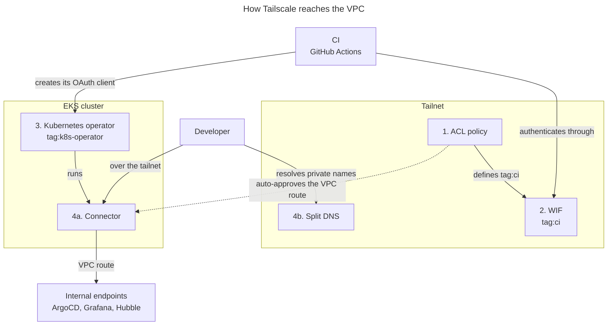

{/* This doc is aggregated into the EKS Forge documentation site: https://eks-forge.readthedocs.io/latest/. It is not meant to be read directly in this repository. */}
# Tailscale

EKS Forge deploys internal tooling ([ArgoCD](https://argo-cd.readthedocs.io/en/stable/), [Prometheus](https://prometheus.io/), [Hubble](https://github.com/cilium/hubble), etc.) as private endpoints inside the VPC, not reachable from the public internet. [Tailscale](https://tailscale.com/) is the VPN that lets developers reach them, and the identity provider CI uses to manage the resources that make that VPN work.

This documentation will explain how Tailscale has been implemented in the EKS stack.
For setup steps, read [Tailscale Bootstrap](/docs/quickstart/bootstrap/tailscale).

There are four components that interact together, created in an order that matters:

## 1. Access Control (ACL) Policy

A [tailnet](https://tailscale.com/docs/concepts/tailnet)-wide [Access Control (ACL) policy](https://tailscale.com/docs/features/access-control/acls) applied by the [`tailscale/acl` bootstrap pipeline](/docs/reference/bootstrap/tailscale_acl/) from the [catalog repository](https://github.com/ConsciousML/eks-forge-catalog). This pipeline needs to be implemented only once per tailnet.

[Tags](https://tailscale.com/docs/features/tags) label devices by role (`tag:ci`, `tag:k8s-operator`) instead of by user identity. The ACL declares these tags, along with grants (rules that let one tag create auth keys for another). It also auto-approves subnet routes for each environment's VPC CIDR, so tagged nodes can advertise routes without manual approval in the Tailscale admin panel.

This is the tailnet's central trust policy: every other piece below depends on a tag or grant it defines.

## 2. Workload Identity Federation (WIF)

A per-repository credential, created by the [`tailscale/wif` bootstrap pipeline](/docs/reference/bootstrap/tailscale_wif/) after the ACL, since its [OAuth client](https://tailscale.com/docs/features/oauth-clients) is scoped to `tag:ci`, a tag only the ACL defines. It lets CI authenticate to the Tailscale API using short-lived, GitHub OIDC-federated tokens instead of a stored OAuth secret.

The ACL gives `tag:ci` the permission to create [auth keys](https://tailscale.com/docs/features/access-control/auth-keys) for `tag:k8s-operator`, which is the permission the Kubernetes operator (below) needs to register itself when CI deploys it into a cluster.

## 3. Kubernetes Operator

The [Tailscale Kubernetes operator](https://tailscale.com/kb/1236/kubernetes-operator) joins an EKS cluster to the tailnet, using an auth key created under `tag:k8s-operator`. Unlike the ACL and WIF, it's deployed per-cluster through [app-of-apps](/docs/applications/how-the-app-of-apps-works/) and is environment scoped.

Its own OAuth client credential is provisioned by the [`oauth_client_tailscale_operator`](../../units/eks/addons/tailscale/oauth_client_tailscale_operator/terragrunt.hcl) and [`oauth_client_secret`](../../units/eks/addons/tailscale/oauth_client_secret/terragrunt.hcl) units, and synced into the cluster via the [External Secrets Operator](https://external-secrets.io/latest/), so the credential itself never lives in git.

## 4. Connector and Split DNS

The operator's `Connector` Custom Resource (CR) advertises the environment's VPC CIDR as a [subnet route](https://tailscale.com/docs/features/subnet-routers). The ACL auto-approves that route, so internal VPC resources become reachable over the tailnet.

Reachability alone doesn't give you working hostnames, so [Split DNS](https://tailscale.com/docs/reference/dns-in-tailscale#restricted-nameservers) units ([`split_dns/default`](../../units/eks/addons/tailscale/split_dns/default/terragrunt.hcl), [`split_dns/eks`](../../units/eks/addons/tailscale/split_dns/eks/terragrunt.hcl)) route two zones through the VPC's DNS resolver over the tailnet: the environment's `private.<env>.<domain>` zone, and the cluster's EKS private API endpoint. Both resolve over the tailnet without ever being publicly registered.